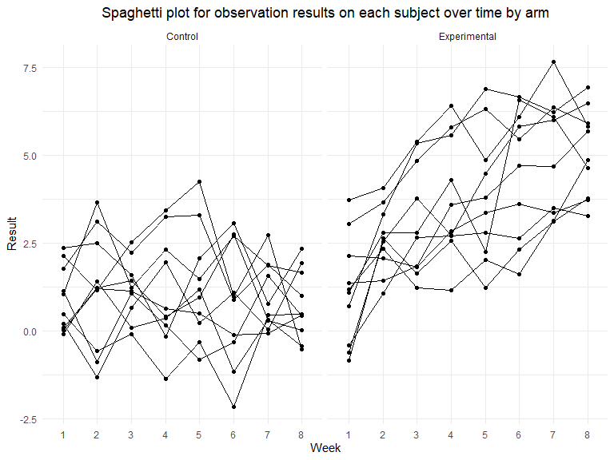
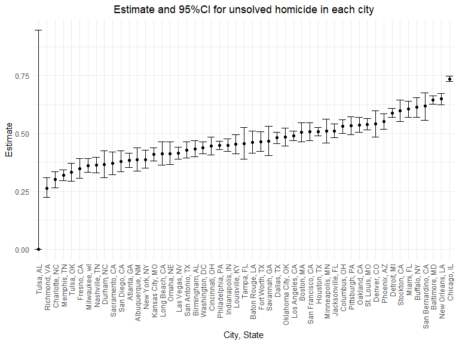
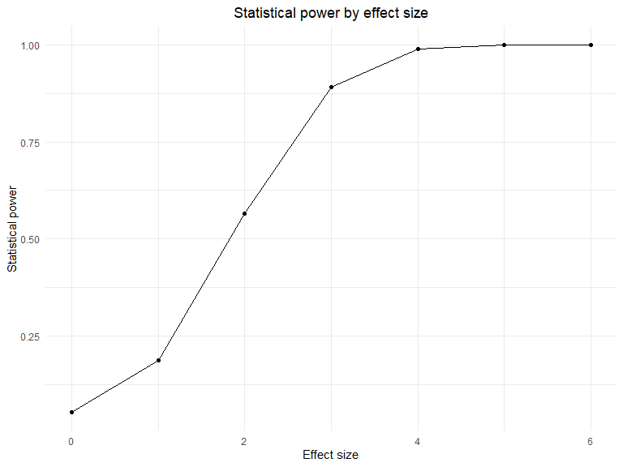
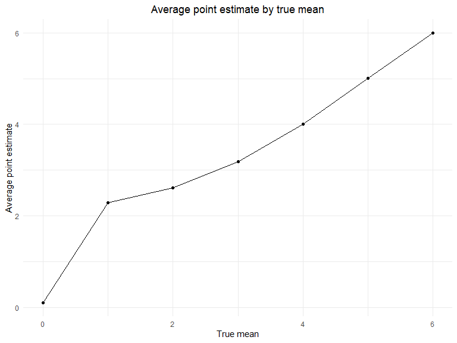

p8105_hw5_yf2605
================
Yi_Fang

# Problem 1

Create a tidy dataframe containing data from all participants, including
the subject ID, arm, and observations over time:

-   create file path list and read data
-   unnest the data
-   separate file name into arm and id
-   tidy the dataset, make the dataset longer with 1 column for week and
    1 column for observation result
-   convert week into a factor variable with 8 levels
-   select required columns: arm, id, week, result

``` r
p1_df = 
  tibble(file_name = list.files(path="data/P1_data")) %>% 
  mutate(
    path = str_c("data/P1_data/", file_name),
    data = map(path, read_csv)
    ) %>% 
  unnest(data) %>% 
  separate(
    col = file_name, 
    into = c("arm","id","suffix"), 
    sep = "\\_|\\.", 
    remove = TRUE
    ) %>% 
  pivot_longer(
    cols = week_1:week_8,
    names_to = "week",
    names_prefix = "week_",
    values_to = "result"
  ) %>% 
  mutate(week = as.factor(week)) %>% 
  select(arm, id, week, result)
```

    ## Rows: 1 Columns: 8
    ## ── Column specification ────────────────────────────────────────────────────────
    ## Delimiter: ","
    ## dbl (8): week_1, week_2, week_3, week_4, week_5, week_6, week_7, week_8
    ## 
    ## ℹ Use `spec()` to retrieve the full column specification for this data.
    ## ℹ Specify the column types or set `show_col_types = FALSE` to quiet this message.
    ## Rows: 1 Columns: 8
    ## ── Column specification ────────────────────────────────────────────────────────
    ## Delimiter: ","
    ## dbl (8): week_1, week_2, week_3, week_4, week_5, week_6, week_7, week_8
    ## 
    ## ℹ Use `spec()` to retrieve the full column specification for this data.
    ## ℹ Specify the column types or set `show_col_types = FALSE` to quiet this message.
    ## Rows: 1 Columns: 8
    ## ── Column specification ────────────────────────────────────────────────────────
    ## Delimiter: ","
    ## dbl (8): week_1, week_2, week_3, week_4, week_5, week_6, week_7, week_8
    ## 
    ## ℹ Use `spec()` to retrieve the full column specification for this data.
    ## ℹ Specify the column types or set `show_col_types = FALSE` to quiet this message.
    ## Rows: 1 Columns: 8
    ## ── Column specification ────────────────────────────────────────────────────────
    ## Delimiter: ","
    ## dbl (8): week_1, week_2, week_3, week_4, week_5, week_6, week_7, week_8
    ## 
    ## ℹ Use `spec()` to retrieve the full column specification for this data.
    ## ℹ Specify the column types or set `show_col_types = FALSE` to quiet this message.
    ## Rows: 1 Columns: 8
    ## ── Column specification ────────────────────────────────────────────────────────
    ## Delimiter: ","
    ## dbl (8): week_1, week_2, week_3, week_4, week_5, week_6, week_7, week_8
    ## 
    ## ℹ Use `spec()` to retrieve the full column specification for this data.
    ## ℹ Specify the column types or set `show_col_types = FALSE` to quiet this message.
    ## Rows: 1 Columns: 8
    ## ── Column specification ────────────────────────────────────────────────────────
    ## Delimiter: ","
    ## dbl (8): week_1, week_2, week_3, week_4, week_5, week_6, week_7, week_8
    ## 
    ## ℹ Use `spec()` to retrieve the full column specification for this data.
    ## ℹ Specify the column types or set `show_col_types = FALSE` to quiet this message.
    ## Rows: 1 Columns: 8
    ## ── Column specification ────────────────────────────────────────────────────────
    ## Delimiter: ","
    ## dbl (8): week_1, week_2, week_3, week_4, week_5, week_6, week_7, week_8
    ## 
    ## ℹ Use `spec()` to retrieve the full column specification for this data.
    ## ℹ Specify the column types or set `show_col_types = FALSE` to quiet this message.
    ## Rows: 1 Columns: 8
    ## ── Column specification ────────────────────────────────────────────────────────
    ## Delimiter: ","
    ## dbl (8): week_1, week_2, week_3, week_4, week_5, week_6, week_7, week_8
    ## 
    ## ℹ Use `spec()` to retrieve the full column specification for this data.
    ## ℹ Specify the column types or set `show_col_types = FALSE` to quiet this message.
    ## Rows: 1 Columns: 8
    ## ── Column specification ────────────────────────────────────────────────────────
    ## Delimiter: ","
    ## dbl (8): week_1, week_2, week_3, week_4, week_5, week_6, week_7, week_8
    ## 
    ## ℹ Use `spec()` to retrieve the full column specification for this data.
    ## ℹ Specify the column types or set `show_col_types = FALSE` to quiet this message.
    ## Rows: 1 Columns: 8
    ## ── Column specification ────────────────────────────────────────────────────────
    ## Delimiter: ","
    ## dbl (8): week_1, week_2, week_3, week_4, week_5, week_6, week_7, week_8
    ## 
    ## ℹ Use `spec()` to retrieve the full column specification for this data.
    ## ℹ Specify the column types or set `show_col_types = FALSE` to quiet this message.
    ## Rows: 1 Columns: 8
    ## ── Column specification ────────────────────────────────────────────────────────
    ## Delimiter: ","
    ## dbl (8): week_1, week_2, week_3, week_4, week_5, week_6, week_7, week_8
    ## 
    ## ℹ Use `spec()` to retrieve the full column specification for this data.
    ## ℹ Specify the column types or set `show_col_types = FALSE` to quiet this message.
    ## Rows: 1 Columns: 8
    ## ── Column specification ────────────────────────────────────────────────────────
    ## Delimiter: ","
    ## dbl (8): week_1, week_2, week_3, week_4, week_5, week_6, week_7, week_8
    ## 
    ## ℹ Use `spec()` to retrieve the full column specification for this data.
    ## ℹ Specify the column types or set `show_col_types = FALSE` to quiet this message.
    ## Rows: 1 Columns: 8
    ## ── Column specification ────────────────────────────────────────────────────────
    ## Delimiter: ","
    ## dbl (8): week_1, week_2, week_3, week_4, week_5, week_6, week_7, week_8
    ## 
    ## ℹ Use `spec()` to retrieve the full column specification for this data.
    ## ℹ Specify the column types or set `show_col_types = FALSE` to quiet this message.
    ## Rows: 1 Columns: 8
    ## ── Column specification ────────────────────────────────────────────────────────
    ## Delimiter: ","
    ## dbl (8): week_1, week_2, week_3, week_4, week_5, week_6, week_7, week_8
    ## 
    ## ℹ Use `spec()` to retrieve the full column specification for this data.
    ## ℹ Specify the column types or set `show_col_types = FALSE` to quiet this message.
    ## Rows: 1 Columns: 8
    ## ── Column specification ────────────────────────────────────────────────────────
    ## Delimiter: ","
    ## dbl (8): week_1, week_2, week_3, week_4, week_5, week_6, week_7, week_8
    ## 
    ## ℹ Use `spec()` to retrieve the full column specification for this data.
    ## ℹ Specify the column types or set `show_col_types = FALSE` to quiet this message.
    ## Rows: 1 Columns: 8
    ## ── Column specification ────────────────────────────────────────────────────────
    ## Delimiter: ","
    ## dbl (8): week_1, week_2, week_3, week_4, week_5, week_6, week_7, week_8
    ## 
    ## ℹ Use `spec()` to retrieve the full column specification for this data.
    ## ℹ Specify the column types or set `show_col_types = FALSE` to quiet this message.
    ## Rows: 1 Columns: 8
    ## ── Column specification ────────────────────────────────────────────────────────
    ## Delimiter: ","
    ## dbl (8): week_1, week_2, week_3, week_4, week_5, week_6, week_7, week_8
    ## 
    ## ℹ Use `spec()` to retrieve the full column specification for this data.
    ## ℹ Specify the column types or set `show_col_types = FALSE` to quiet this message.
    ## Rows: 1 Columns: 8
    ## ── Column specification ────────────────────────────────────────────────────────
    ## Delimiter: ","
    ## dbl (8): week_1, week_2, week_3, week_4, week_5, week_6, week_7, week_8
    ## 
    ## ℹ Use `spec()` to retrieve the full column specification for this data.
    ## ℹ Specify the column types or set `show_col_types = FALSE` to quiet this message.
    ## Rows: 1 Columns: 8
    ## ── Column specification ────────────────────────────────────────────────────────
    ## Delimiter: ","
    ## dbl (8): week_1, week_2, week_3, week_4, week_5, week_6, week_7, week_8
    ## 
    ## ℹ Use `spec()` to retrieve the full column specification for this data.
    ## ℹ Specify the column types or set `show_col_types = FALSE` to quiet this message.
    ## Rows: 1 Columns: 8
    ## ── Column specification ────────────────────────────────────────────────────────
    ## Delimiter: ","
    ## dbl (8): week_1, week_2, week_3, week_4, week_5, week_6, week_7, week_8
    ## 
    ## ℹ Use `spec()` to retrieve the full column specification for this data.
    ## ℹ Specify the column types or set `show_col_types = FALSE` to quiet this message.

Make a spaghetti plot showing observations on each subject over time,
and comment on differences between groups.

``` r
p1_df %>%
  mutate(
    arm = ifelse(arm == "con", "Control", "Experimental")
  ) %>% 
  ggplot(
    aes(
      x = week, 
      y = result, 
      group = id)
    ) +
  geom_point()+
  geom_line()+
  facet_grid(. ~ arm)+
  labs(
    title = "Spaghetti plot for observation results on each subject over time by arm",
    x = "Week",
    y = "Result"
  )
```



-   For the experimental group, the observation results seemed to
    increase over time.
-   For the control group, there seemed to be no trend in the
    observation results over time.

# Problem 2

``` r
homicide = read_csv("data/homicide-data.csv")
```

    ## Rows: 52179 Columns: 12
    ## ── Column specification ────────────────────────────────────────────────────────
    ## Delimiter: ","
    ## chr (9): uid, victim_last, victim_first, victim_race, victim_age, victim_sex...
    ## dbl (3): reported_date, lat, lon
    ## 
    ## ℹ Use `spec()` to retrieve the full column specification for this data.
    ## ℹ Specify the column types or set `show_col_types = FALSE` to quiet this message.

Description: The raw data set contains 12 variables and 52179 records.

-   uid, reported_date, victim_last, victim_first, victim_race,
    victim_age, victim_sex, city, state, lat, lon, disposition

Create a city_state variable (e.g. “Baltimore, MD”)

``` r
homicide = 
  homicide %>% 
  mutate(
    city_state = str_c(city, ", ", state)
  ) 
```

summarize within cities to obtain the total number of homicides and the
number of unsolved homicides (those for which the disposition is “Closed
without arrest” or “Open/No arrest”).

``` r
city_sum = 
  homicide %>% 
  group_by(city_state) %>% 
  summarize(
    n_homicide = n(),
    n_unsolved = sum(disposition == "Closed without arrest" | 
                     disposition == "Open/No arrest")
  ) 
  
city_sum %>% knitr::kable()
```

| city_state         | n_homicide | n_unsolved |
|:-------------------|-----------:|-----------:|
| Albuquerque, NM    |        378 |        146 |
| Atlanta, GA        |        973 |        373 |
| Baltimore, MD      |       2827 |       1825 |
| Baton Rouge, LA    |        424 |        196 |
| Birmingham, AL     |        800 |        347 |
| Boston, MA         |        614 |        310 |
| Buffalo, NY        |        521 |        319 |
| Charlotte, NC      |        687 |        206 |
| Chicago, IL        |       5535 |       4073 |
| Cincinnati, OH     |        694 |        309 |
| Columbus, OH       |       1084 |        575 |
| Dallas, TX         |       1567 |        754 |
| Denver, CO         |        312 |        169 |
| Detroit, MI        |       2519 |       1482 |
| Durham, NC         |        276 |        101 |
| Fort Worth, TX     |        549 |        255 |
| Fresno, CA         |        487 |        169 |
| Houston, TX        |       2942 |       1493 |
| Indianapolis, IN   |       1322 |        594 |
| Jacksonville, FL   |       1168 |        597 |
| Kansas City, MO    |       1190 |        486 |
| Las Vegas, NV      |       1381 |        572 |
| Long Beach, CA     |        378 |        156 |
| Los Angeles, CA    |       2257 |       1106 |
| Louisville, KY     |        576 |        261 |
| Memphis, TN        |       1514 |        483 |
| Miami, FL          |        744 |        450 |
| Milwaukee, wI      |       1115 |        403 |
| Minneapolis, MN    |        366 |        187 |
| Nashville, TN      |        767 |        278 |
| New Orleans, LA    |       1434 |        930 |
| New York, NY       |        627 |        243 |
| Oakland, CA        |        947 |        508 |
| Oklahoma City, OK  |        672 |        326 |
| Omaha, NE          |        409 |        169 |
| Philadelphia, PA   |       3037 |       1360 |
| Phoenix, AZ        |        914 |        504 |
| Pittsburgh, PA     |        631 |        337 |
| Richmond, VA       |        429 |        113 |
| Sacramento, CA     |        376 |        139 |
| San Antonio, TX    |        833 |        357 |
| San Bernardino, CA |        275 |        170 |
| San Diego, CA      |        461 |        175 |
| San Francisco, CA  |        663 |        336 |
| Savannah, GA       |        246 |        115 |
| St. Louis, MO      |       1677 |        905 |
| Stockton, CA       |        444 |        266 |
| Tampa, FL          |        208 |         95 |
| Tulsa, AL          |          1 |          0 |
| Tulsa, OK          |        583 |        193 |
| Washington, DC     |       1345 |        589 |

For the city of Baltimore, MD, use the prop.test function to estimate
the proportion of homicides that are unsolved;

save the output of prop.test as an R object, apply the broom::tidy to
this object and pull the estimated proportion and confidence intervals
from the resulting tidy dataframe.

``` r
baltimore_sum = 
  city_sum %>% 
  filter(city_state == "Baltimore, MD")

baltimore_result = 
  prop.test(
  x = baltimore_sum[['n_unsolved']], 
  n = baltimore_sum[['n_homicide']]
  ) %>% 
  broom::tidy() %>% 
  select(estimate, conf.low, conf.high)

baltimore_result %>% knitr::kable(digits = 2)
```

| estimate | conf.low | conf.high |
|---------:|---------:|----------:|
|     0.65 |     0.63 |      0.66 |

Run prop.test for each of the cities in your dataset, and extract both
the proportion of unsolved homicides and the confidence interval for
each.

Do this within a “tidy” pipeline, making use of purrr::map, purrr::map2,
list columns and unnest as necessary to create a tidy dataframe with
estimated proportions and CIs for each city.

``` r
tidy_ptest = function(x, n){
  result_df = 
    prop.test(
      x = x, 
      n = n
    )%>% 
    broom::tidy() %>% 
    select(estimate, conf.low, conf.high)

  result_df
}

city_result = 
  city_sum %>% 
  mutate(
    result_df = purrr::map2(
      .x = n_unsolved, 
      .y = n_homicide, 
      ~tidy_ptest(x = .x, n = .y)
    )
  ) %>% 
  unnest(result_df)

city_result %>% knitr::kable(digits = 2)
```

| city_state         | n_homicide | n_unsolved | estimate | conf.low | conf.high |
|:-------------------|-----------:|-----------:|---------:|---------:|----------:|
| Albuquerque, NM    |        378 |        146 |     0.39 |     0.34 |      0.44 |
| Atlanta, GA        |        973 |        373 |     0.38 |     0.35 |      0.41 |
| Baltimore, MD      |       2827 |       1825 |     0.65 |     0.63 |      0.66 |
| Baton Rouge, LA    |        424 |        196 |     0.46 |     0.41 |      0.51 |
| Birmingham, AL     |        800 |        347 |     0.43 |     0.40 |      0.47 |
| Boston, MA         |        614 |        310 |     0.50 |     0.46 |      0.55 |
| Buffalo, NY        |        521 |        319 |     0.61 |     0.57 |      0.65 |
| Charlotte, NC      |        687 |        206 |     0.30 |     0.27 |      0.34 |
| Chicago, IL        |       5535 |       4073 |     0.74 |     0.72 |      0.75 |
| Cincinnati, OH     |        694 |        309 |     0.45 |     0.41 |      0.48 |
| Columbus, OH       |       1084 |        575 |     0.53 |     0.50 |      0.56 |
| Dallas, TX         |       1567 |        754 |     0.48 |     0.46 |      0.51 |
| Denver, CO         |        312 |        169 |     0.54 |     0.48 |      0.60 |
| Detroit, MI        |       2519 |       1482 |     0.59 |     0.57 |      0.61 |
| Durham, NC         |        276 |        101 |     0.37 |     0.31 |      0.43 |
| Fort Worth, TX     |        549 |        255 |     0.46 |     0.42 |      0.51 |
| Fresno, CA         |        487 |        169 |     0.35 |     0.31 |      0.39 |
| Houston, TX        |       2942 |       1493 |     0.51 |     0.49 |      0.53 |
| Indianapolis, IN   |       1322 |        594 |     0.45 |     0.42 |      0.48 |
| Jacksonville, FL   |       1168 |        597 |     0.51 |     0.48 |      0.54 |
| Kansas City, MO    |       1190 |        486 |     0.41 |     0.38 |      0.44 |
| Las Vegas, NV      |       1381 |        572 |     0.41 |     0.39 |      0.44 |
| Long Beach, CA     |        378 |        156 |     0.41 |     0.36 |      0.46 |
| Los Angeles, CA    |       2257 |       1106 |     0.49 |     0.47 |      0.51 |
| Louisville, KY     |        576 |        261 |     0.45 |     0.41 |      0.49 |
| Memphis, TN        |       1514 |        483 |     0.32 |     0.30 |      0.34 |
| Miami, FL          |        744 |        450 |     0.60 |     0.57 |      0.64 |
| Milwaukee, wI      |       1115 |        403 |     0.36 |     0.33 |      0.39 |
| Minneapolis, MN    |        366 |        187 |     0.51 |     0.46 |      0.56 |
| Nashville, TN      |        767 |        278 |     0.36 |     0.33 |      0.40 |
| New Orleans, LA    |       1434 |        930 |     0.65 |     0.62 |      0.67 |
| New York, NY       |        627 |        243 |     0.39 |     0.35 |      0.43 |
| Oakland, CA        |        947 |        508 |     0.54 |     0.50 |      0.57 |
| Oklahoma City, OK  |        672 |        326 |     0.49 |     0.45 |      0.52 |
| Omaha, NE          |        409 |        169 |     0.41 |     0.37 |      0.46 |
| Philadelphia, PA   |       3037 |       1360 |     0.45 |     0.43 |      0.47 |
| Phoenix, AZ        |        914 |        504 |     0.55 |     0.52 |      0.58 |
| Pittsburgh, PA     |        631 |        337 |     0.53 |     0.49 |      0.57 |
| Richmond, VA       |        429 |        113 |     0.26 |     0.22 |      0.31 |
| Sacramento, CA     |        376 |        139 |     0.37 |     0.32 |      0.42 |
| San Antonio, TX    |        833 |        357 |     0.43 |     0.39 |      0.46 |
| San Bernardino, CA |        275 |        170 |     0.62 |     0.56 |      0.68 |
| San Diego, CA      |        461 |        175 |     0.38 |     0.34 |      0.43 |
| San Francisco, CA  |        663 |        336 |     0.51 |     0.47 |      0.55 |
| Savannah, GA       |        246 |        115 |     0.47 |     0.40 |      0.53 |
| St. Louis, MO      |       1677 |        905 |     0.54 |     0.52 |      0.56 |
| Stockton, CA       |        444 |        266 |     0.60 |     0.55 |      0.64 |
| Tampa, FL          |        208 |         95 |     0.46 |     0.39 |      0.53 |
| Tulsa, AL          |          1 |          0 |     0.00 |     0.00 |      0.95 |
| Tulsa, OK          |        583 |        193 |     0.33 |     0.29 |      0.37 |
| Washington, DC     |       1345 |        589 |     0.44 |     0.41 |      0.46 |

Create a plot that shows the estimates and CIs for each city – check out
geom_errorbar for a way to add error bars based on the upper and lower
limits.

Organize cities according to the proportion of unsolved homicides.

``` r
city_result %>% 
  mutate(
    city_state = fct_reorder(city_state, estimate)
  ) %>% 
  ggplot(aes(
    x = city_state,
    y = estimate
  ))+
  geom_point() +
  geom_errorbar(aes(ymin = conf.low, 
                    ymax = conf.high
                    ))+
  labs(
    title = "Estimate and 95%CI for unsolved homicide in each city",
    x = "City, State",
    y = "Estimate"
  )+
  theme(axis.text.x = element_text(angle = 90, vjust = 0.5, hjust=1))
```



# Problem 3

Set the following design elements:

Fix n=30 Fix σ=5 Set μ=0. Generate 5000 datasets from the model

x∼Normal\[μ,σ\]

For each dataset, save μ^ and the p-value arising from a test of H:μ=0
using α=0.05. Hint: to obtain the estimate and p-value, use broom::tidy
to clean the output of t.test.

``` r
sim_fuc = function(x) {
  
  sim_data = function(mu) {
    
    data = tibble(
      x = rnorm(n = 30, mean = mu, sd = 5),
    )
    
    data
  }
  
  sim_df = 
    expand_grid(
      mu = x,
      iter = 1:5000
    ) %>% 
    mutate(
      data = map(mu, sim_data)
    )
  
  tidy_ttest = function(df) {
    
    test_result = 
      t.test(x=df[['x']], mu=0) %>% 
      broom::tidy() %>% 
      select(estimate, p.value)
    
    test_result
  }
  
  result_df = 
    sim_df %>% 
    mutate(
      result = map(data, tidy_ttest)
    ) %>% 
    unnest(result)

  result_df
}


sim_fuc(0)
```

    ## # A tibble: 5,000 × 5
    ##       mu  iter data              estimate p.value
    ##    <dbl> <int> <list>               <dbl>   <dbl>
    ##  1     0     1 <tibble [30 × 1]>   0.994   0.155 
    ##  2     0     2 <tibble [30 × 1]>  -1.28    0.154 
    ##  3     0     3 <tibble [30 × 1]>  -0.957   0.295 
    ##  4     0     4 <tibble [30 × 1]>   0.263   0.705 
    ##  5     0     5 <tibble [30 × 1]>   0.0212  0.984 
    ##  6     0     6 <tibble [30 × 1]>  -0.920   0.363 
    ##  7     0     7 <tibble [30 × 1]>  -2.15    0.0248
    ##  8     0     8 <tibble [30 × 1]>  -0.187   0.871 
    ##  9     0     9 <tibble [30 × 1]>   0.414   0.618 
    ## 10     0    10 <tibble [30 × 1]>  -0.867   0.410 
    ## # … with 4,990 more rows

Repeat the above for μ={1,2,3,4,5,6}

``` r
sim_result = 
  expand_grid(
    iter = 0:6
  ) %>% 
  mutate(
    result = map(iter, sim_fuc)
  ) %>% 
  select(-iter) %>% 
  unnest(result) %>% 
  select(-iter)
```

**Make a plot showing the proportion of times the null was rejected (the
power of the test) on the y axis and the true value of μ on the x axis.
Describe the association between effect size and power.**

``` r
sim_result %>% 
  group_by(mu) %>% 
  summarize(
    n_test = n(),
    n_rejected = sum(p.value < 0.05),
    power = n_rejected/n_test
  ) %>% 
  ggplot(aes(
    x = mu,
    y = power
  ))+
  geom_point() +
  geom_line() +
  labs(
    title = "Statistical power by effect size",
    x = "Effect size",
    y = "Statistical power"
  )
```



Effect size is positively associated with statistical power.

**Make a plot showing the average estimate of μ^ on the y axis and the
true value of μ on the x axis. Make a second plot (or overlay on the
first) the average estimate of μ^ only in samples for which the null was
rejected on the y axis and the true value of μ on the x axis. Is the
sample average of μ^ across tests for which the null is rejected
approximately equal to the true value of μ? Why or why not?**

``` r
sim_result %>% 
  filter(p.value < 0.05) %>% 
  group_by(mu) %>% 
  summarize(
    average_mu_hat = mean(estimate) 
  ) %>% 
  ggplot(aes(
    x = mu,
    y = average_mu_hat
  ))+
  geom_point() +
  geom_line() +
  labs(
    title = "Average point estimate by true mean",
    x = "True mean",
    y = "Average point estimate"
  )
```



The sample average of point estimate across tests for which the null is
rejected is approximately equal to the true value of μ, because

-   we simulated the data based on true mean
-   we excluded the outliers whose hypothesis test result id fail to
    reject the null
